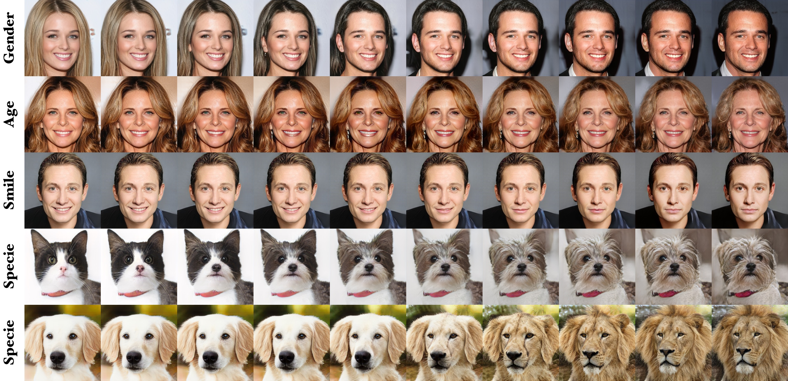

## Smoothing the Disentangled Latent Style Space for Unsupervised Image-to-image Translation


[]((https://github.com/yhlleo/SmoothingLatentSpace/graphs/commit-activity))


**[[Paper]](./) | [[Poster]](./) | [[Codes]](https://github.com/yhlleo/SmoothingLatentSpace)** <br> 
[Yahui Liu](https://yhlleo.github.io/)<sup>1,3</sup>, 
[Enver Sangineto](https://scholar.google.com/citations?user=eJZlvlAAAAAJ&hl=it)<sup>1</sup>, 
Yajing Chen<sup>2</sup>, 
[Linchao Bao](https://scholar.google.com/citations?user=xQZMbkUAAAAJ&hl=en)<sup>2</sup>, 
Haoxian Zhang<sup>2</sup>, 
[Nicu Sebe](https://scholar.google.com/citations?user=stFCYOAAAAAJ&hl=en)<sup>1</sup>, 
[Bruno Lepri](https://scholar.google.com/citations?hl=en&user=JfcopG0AAAAJ)<sup>3</sup>,
[Wei Wang](https://scholar.google.com/citations?hl=en&user=k4SdlbcAAAAJ)<sup>1</sup>,
[Marco De Nadai](https://scholar.google.com/citations?user=_4-U61wAAAAJ&hl=en)<sup>3</sup> <br>
<sup>1</sup>University of Trento, Italy, <sup>2</sup>Tencent AI Lab, China, <sup>3</sup>Bruno Kessler Foundation, Italy. <br>
To appear in **[CVPR 2021](http://cvpr2021.thecvf.com/)**  <br>
The repository offers the official implementation of our paper in PyTorch.

> Image-to-Image (I2I) multi-domain translation models are usually evaluated also using the quality of their semantic interpolation results. However, state-of-the-art models frequently show abrupt changes in the image appearance during interpolation, and usually perform poorly in interpolations across domains. In this paper, we propose a new training protocol based on three specific losses which help a translation network to learn a smooth and disentangled latent style space in which: 1) Both intra- and inter-domain interpolations correspond to gradual changes in the generated images and 2) The content of the source image is better preserved during the translation. Moreover, we propose a novel evaluation metric to properly measure the smoothness of latent style space  of I2I translation models. The proposed method can be plugged in existing translation approaches, and our extensive experiments on different datasets show that it can significantly boost the quality of the generated images and the graduality of the interpolations. 

<p align="center">

<br>
Our method generates smooth interpolations within and across domains in various image-to-image translation tasks.
</p>

### 1.Configuration

See the [`environment.yml`](./environment.yml). We provide an user-friendly configuring method via Conda system, and you can create a new Conda environment using the command:

```
conda env create -f environment.yml
```

Codes will be released soon ...

### 2.Testing

### 3.Training

 - Data Preparing

 - Training

### Citation


### Acknowledgments 
