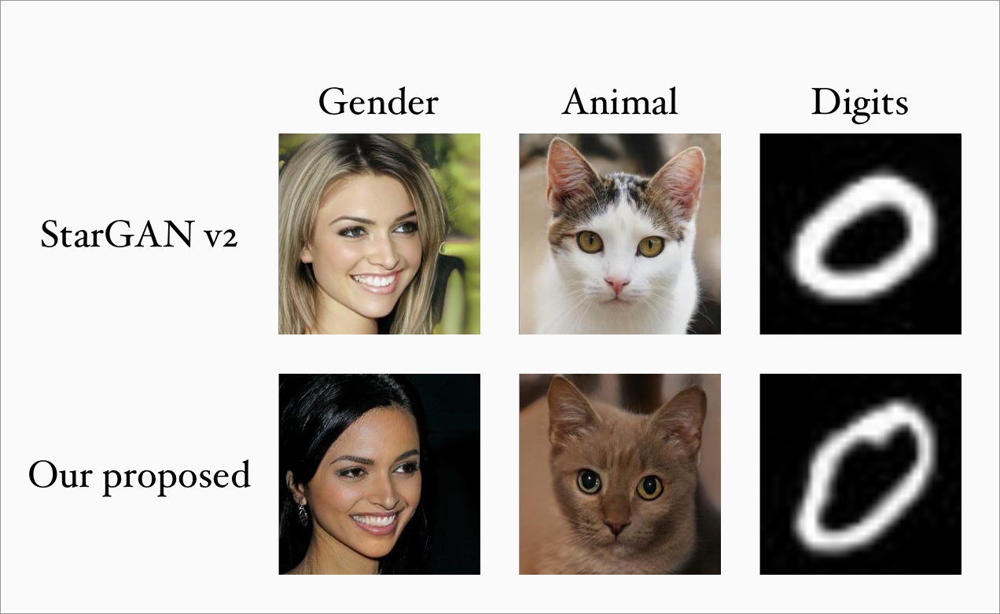

<br><br><br>

## Smoothing the Disentangled Latent Style Space for Unsupervised Image-to-image Translation


[]((https://github.com/yhlleo/SmoothingLatentSpace/graphs/commit-activity))


**[[Paper]](https://openaccess.thecvf.com/content/CVPR2021/papers/Liu_Smoothing_the_Disentangled_Latent_Style_Space_for_Unsupervised_Image-to-Image_Translation_CVPR_2021_paper.pdf) | [[Supp]](https://openaccess.thecvf.com/content/CVPR2021/supplemental/Liu_Smoothing_the_Disentangled_CVPR_2021_supplemental.pdf) | [[Poster]](https://drive.google.com/file/d/1rf3QhHXKkPdLjdbTDGlzzQqG3KR9x9cu/view?usp=sharing) | [[Video]](https://drive.google.com/file/d/1PNEym3Zc48trSs6BZzf7s_tkIUC3rGhr/view?usp=sharing) | [[Codes]](https://github.com/yhlleo/SmoothingLatentSpace)** <br> 
[Yahui Liu](https://yhlleo.github.io/)<sup>1,3</sup>, 
[Enver Sangineto](https://scholar.google.com/citations?user=eJZlvlAAAAAJ&hl=it)<sup>1</sup>, 
Yajing Chen<sup>2</sup>, 
[Linchao Bao](https://scholar.google.com/citations?user=xQZMbkUAAAAJ&hl=en)<sup>2</sup>, 
Haoxian Zhang<sup>2</sup>, 
[Nicu Sebe](https://scholar.google.com/citations?user=stFCYOAAAAAJ&hl=en)<sup>1</sup>, 
[Bruno Lepri](https://scholar.google.com/citations?hl=en&user=JfcopG0AAAAJ)<sup>3</sup>,
[Wei Wang](https://scholar.google.com/citations?hl=en&user=k4SdlbcAAAAJ)<sup>1</sup>,
[Marco De Nadai](https://scholar.google.com/citations?user=_4-U61wAAAAJ&hl=en)<sup>3</sup> <br>
<sup>1</sup>University of Trento, Italy, <sup>2</sup>Tencent AI Lab, China, <sup>3</sup>Bruno Kessler Foundation, Italy. <br>
To appear in **[CVPR 2021](http://cvpr2021.thecvf.com/)**  <br>
The repository offers the official implementation of our paper in PyTorch.

> Image-to-Image (I2I) multi-domain translation models are usually evaluated also using the quality of their semantic interpolation results. However, state-of-the-art models frequently show abrupt changes in the image appearance during interpolation, and usually perform poorly in interpolations across domains. In this paper, we propose a new training protocol based on three specific losses which help a translation network to learn a smooth and disentangled latent style space in which: 1) Both intra- and inter-domain interpolations correspond to gradual changes in the generated images and 2) The content of the source image is better preserved during the translation. Moreover, we propose a novel evaluation metric to properly measure the smoothness of latent style space  of I2I translation models. The proposed method can be plugged in existing translation approaches, and our extensive experiments on different datasets show that it can significantly boost the quality of the generated images and the graduality of the interpolations. 

<p align="center">

<br>
Our method generates smooth interpolations within and across domains in various image-to-image translation tasks.
</p>

### Teaser video
Click the figure to watch the teaser video. <br/>

[](https://youtu.be/Mop3EVGm8no)

### 1.Configuration

See the [`environment.yml`](./environment.yml). We provide an user-friendly configuring method via Conda system, and you can create a new Conda environment using the command:

```
conda env create -f environment.yml
```

### 2.Fast testing

For fast testing, we provide pretrained models on CelebA-HQ (gender) and AFHQ (animal faces):

|CelebA-HQ|AFHQ|
|:----:|:----:|
|[GoogleDrive](https://drive.google.com/file/d/1rWksiZQAu3k0S0ttnM_lke4-Ow6EeqkH/view?usp=sharing)|[GoogleDrive](https://drive.google.com/file/d/1HRT0qdWtpf13TL0nFQedlFPpV8GA5i_-/view?usp=sharing)|

The models can be tested directly by using the offical codes of [StarGAN v2](https://github.com/clovaai/stargan-v2).

### 3.Usage

 - Data Preparation: 
 
Please download the `CelebA-HQ`, `AFHQ`, `wing.ckpt` and `celeba_lm_mean.npz` provided in [StarGAN v2](https://github.com/clovaai/stargan-v2).

 - Training: 

We provide a script to start the training (the path of the dataset and models should be specified):

```
sh train.sh
```

 - Interpolate between two latent codes:

```
python3 main.py \
  --mode inter \
  --checkpoint_dir [path to the trained model folder] \
  --resume_iter [iterations of the save model] \
  --input [input image path] \
  --w_hpf [1 for celeba-hq, 0 for afhq] \
  --save_dir [save folder] \
  --wing_path [path to wing.ckpt] \
  --lm_path [path to celeba_lm_mean.npz]
```

 - Test a single image by using a random latent or a reference image:

```
python3 main.py \
  --mode test \
  --checkpoint_dir [path to the trained model folder] \
  --resume_iter [iterations of the save model] \
  --input [input image path] \
  --test_mode [latent or reference] \
  --input_ref [referece image path, used only in reference mode] \
  --w_hpf [1 for celeba-hq, 0 for afhq] \
  --save_dir [save folder] \
  --wing_path [path to wing.ckpt] \
  --lm_path [path to celeba_lm_mean.npz]
```

 - Generate a video by using latent codes:

```
python3 main.py \
  --mode video \
  --checkpoint_dir [path to the trained model folder] \
  --resume_iter [iterations of the save model] \
  --input [input image path] \
  --w_hpf [1 for celeba-hq, 0 for afhq] \
  --save_dir save_dir \
  --wing_path [path to wing.ckpt] \
  --lm_path [path to celeba_lm_mean.npz]
```

 - Smoothness Evaluation:

```
python3 ps_eval.py --data_dir /path/to/data --num_inters 20
```


### Acknowledgments 

This code is based on the [StarGAN v2](https://github.com/clovaai/stargan-v2). Thanks to the contributors of this project.

### Citation

```
@InProceedings{Liu_2021_CVPR,
    author    = {Liu, Yahui and Sangineto, Enver and Chen, Yajing and Bao, Linchao and Zhang, Haoxian and Sebe, Nicu and Lepri, Bruno and Wang, Wei and De Nadai, Marco},
    title     = {Smoothing the Disentangled Latent Style Space for Unsupervised Image-to-Image Translation},
    booktitle = {Proceedings of the IEEE/CVF Conference on Computer Vision and Pattern Recognition (CVPR)},
    month     = {June},
    year      = {2021},
    pages     = {10785-10794}
}
```

If you have any questions, please contact me without hesitation (yahui.liu AT unitn.it).
